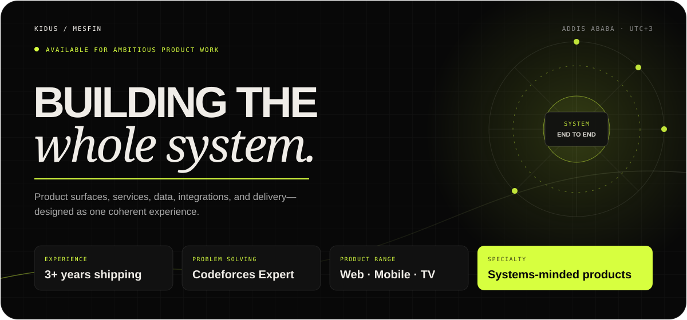
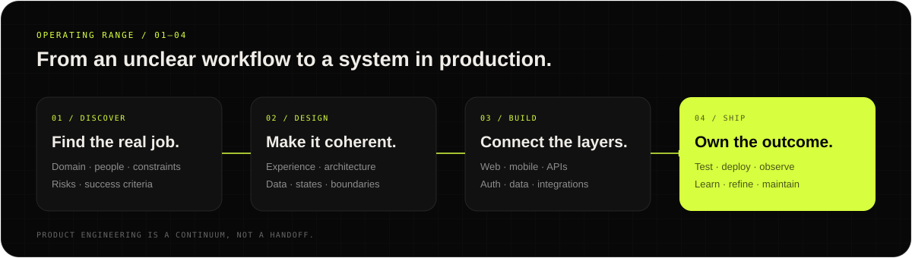

<picture>
  <source media="(prefers-color-scheme: dark)" srcset="./assets/hero-dark.svg">
  <source media="(prefers-color-scheme: light)" srcset="./assets/hero-light.svg">
  
</picture>

  <a href="https://kidusmesfinportfolio.vercel.app/"><strong>PORTFOLIO</strong></a>
  &nbsp;&nbsp;·&nbsp;&nbsp;
  <a href="https://kidusmesfinportfolio.vercel.app/resume.pdf"><strong>RÉSUMÉ</strong></a>
  &nbsp;&nbsp;·&nbsp;&nbsp;
  <a href="https://www.linkedin.com/in/kidus-m"><strong>LINKEDIN</strong></a>
  &nbsp;&nbsp;·&nbsp;&nbsp;
  <a href="mailto:kidusmesfinteferi@gmail.com"><strong>EMAIL</strong></a>

---

## I turn complicated workflows into software people can trust.

I’m a software engineer in Addis Ababa who works across the full product surface: interface, application logic, data model, integrations, deployment, and iteration. I’m most useful when a project is still a little messy—when the real job is to understand the operation, choose the right architecture, and carry it all the way to a polished product.

At **Andro Solutions**, I lead client platform work and mentor developers. Beyond that, I’ve built real-time operations software, cross-platform mobile apps, secure payment and membership flows, AI-assisted research tools, and media products spanning web, mobile, and TV.

> My edge is not knowing the most tools. It is knowing how the pieces should work together—and taking responsibility for the result.

 

## Selected systems

<table>
  <tr>
    <td width="50%" valign="top">
      01 / MEMBER COMMERCE
      <h3><a href="https://github.com/Kidus-M/Orit-Tej-Mobile">Orit Tej</a></h3>
      
<strong>A mobile membership and pickup ecosystem, built end to end.</strong>

      
Flutter member experience plus a Next.js API for persistent device sessions, recurring Stripe payments, inventory broadcasts, benefits, and secure one-time pickup QR flows.

      
<code>Flutter</code> <code>Next.js</code> <code>TypeScript</code> <code>Neon/Postgres</code> <code>Drizzle</code> <code>Stripe</code>

      
<a href="https://github.com/Kidus-M/Orit-Tej-Mobile">Mobile app ↗</a> · <a href="https://github.com/Kidus-M/Orit-Backend">Backend ↗</a>

    </td>
    <td width="50%" valign="top">
      02 / APPLIED AI
      <h3><a href="https://github.com/Kidus-M/ProspectAI">ProspectAI</a></h3>
      
<strong>A research-to-outreach workspace with explainable context.</strong>

      
Collects websites, GitHub signals, notes, and profile screenshots; synthesizes source material; generates tailored messages with model fallbacks; and manages the conversation in one authenticated workspace.

      
<code>Next.js 15</code> <code>React</code> <code>TypeScript</code> <code>Postgres</code> <code>Better Auth</code> <code>OpenRouter</code>

      
<a href="https://github.com/Kidus-M/ProspectAI">Explore the code ↗</a>

    </td>
  </tr>
  <tr>
    <td width="50%" valign="top">
      03 / MULTI-SURFACE PRODUCT
      <h3><a href="https://github.com/Kidus-M/StreamSynx">StreamSynx</a></h3>
      
<strong>A social viewing and media-discovery product across web, mobile, and TV.</strong>

      
Combines TMDB discovery, Firebase identity and data, watch history, favorites, recommendations, buddies, real-time watch-party rooms and chat—with a Flutter client and a native Android TV experience.

      
<code>Next.js</code> <code>Flutter</code> <code>Android TV</code> <code>Firebase</code> <code>TMDB</code>

      
<a href="https://github.com/Kidus-M/StreamSynx">Repository ↗</a> · <a href="https://streamsynx.vercel.app/">Live product ↗</a>

    </td>
    <td width="50%" valign="top">
      04 / OPERATIONS PLATFORM
      <h3><a href="https://oz-kitchen-blue.vercel.app/">Oz Kitchen</a></h3>
      
<strong>One operational system from order to delivery.</strong>

      
Unified customer ordering, kitchen queues, administration, delivery assignment, payments, partner referrals, and Telegram automation over a real-time Postgres foundation.

      
<code>React</code> <code>TypeScript</code> <code>Supabase</code> <code>PostgreSQL</code> <code>RLS</code> <code>Automation</code>

      
<a href="https://oz-kitchen-blue.vercel.app/">Visit the product ↗</a>

    </td>
  </tr>
</table>

 

<picture>
  <source media="(prefers-color-scheme: dark)" srcset="./assets/operating-range-dark.svg">
  <source media="(prefers-color-scheme: light)" srcset="./assets/operating-range-light.svg">
  
</picture>

## Experience, compressed

| When | Role | What I was trusted with |
|---|---|---|
| **2025 — now** | **Senior Software Developer · Andro Solutions** | Leading full-stack client platforms, architecture, CI/CD, and developer mentorship; reduced deployment time by 40%. |
| **2026** | **Lead Systems & Platform Engineer · Oz Kitchen** | Sole ownership of architecture, product surfaces, backend services, database design, automation, deployment, and iteration. |
| **2026** | **Head of Education · A2SV** | Designed DSA training, led problem-solving sessions, reviewed technical work, and mentored software engineering students. |
| **2025** | **Full-Stack Developer · Temaribet** | Built education-platform dashboards, FastAPI services, Redis caching, RabbitMQ workers, and React Native / Next.js features. |
| **2022 — 2024** | **Junior Software Developer · The Idea Vault** | Shipped websites and visual systems while supporting brand consistency across Ethiopia and Kenya. |

I’m also completing a **BSc in Computer Science at HiLCoE** and trained in advanced data structures and algorithms through **A2SV**.

 

## How I engineer

| Product thinking | Systems thinking | Delivery thinking |
|---|---|---|
| Start from the user and the operating reality—not the framework. | Model boundaries, data, failure cases, permissions, and integrations early. | Keep the path to production visible: tests, observability, deployment, and feedback. |
| Build interfaces with hierarchy, motion, and accessibility in mind. | Prefer boring, legible architecture until complexity earns something more. | Treat documentation and maintainability as part of the shipped product. |

### Tools, grouped by responsibility

- **Product surfaces:** TypeScript, React, Next.js, Flutter/Dart, React Native, Tailwind CSS, motion and interaction design
- **Services & integrations:** Node.js, Express, FastAPI, Go/Gin, REST APIs, payments, webhooks, background work, automation
- **Data & real time:** PostgreSQL, Supabase, Neon, Drizzle, MongoDB, Firebase, Redis, RabbitMQ
- **Engineering practice:** system design, API design, authentication, Git, CI/CD, testing, Figma, deployment and performance work

 

## Algorithms are part of the craft.

Product work benefits from patience, decomposition, and the ability to reason under constraints. I keep those muscles sharp through competitive programming—and I’ve also taught them.

  <a href="https://codeforces.com/profile/KidusMesfin"><strong>CODEFORCES EXPERT</strong> 1690 peak · 234 problems solved</a>
  &nbsp;&nbsp;&nbsp;&nbsp;&nbsp;&nbsp;
  <a href="https://leetcode.com/u/Kidus_Mesfin/"><strong>LEETCODE</strong> 850+ problems solved</a>
  &nbsp;&nbsp;&nbsp;&nbsp;&nbsp;&nbsp;
  <a href="https://a2sv.org"><strong>A2SV</strong> member · former Head of Education</a>

---

  <h2>Have a difficult workflow? I’d like to understand it.</h2>
  
I’m open to ambitious product work, platform engineering, and technical collaborations.

  

    <a href="mailto:kidusmesfinteferi@gmail.com"><strong>Start a conversation ↗</strong></a>
    &nbsp;&nbsp;·&nbsp;&nbsp;
    <a href="https://kidusmesfinportfolio.vercel.app/"><strong>See the full portfolio ↗</strong></a>
  

  Addis Ababa, Ethiopia · UTC+3

