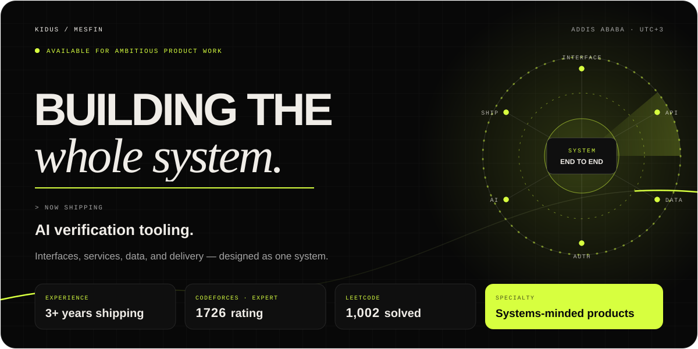
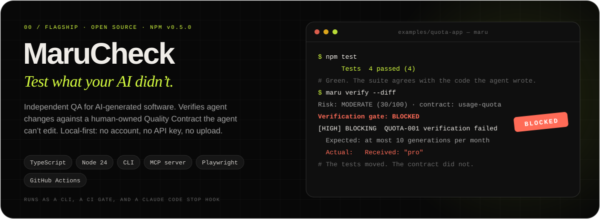
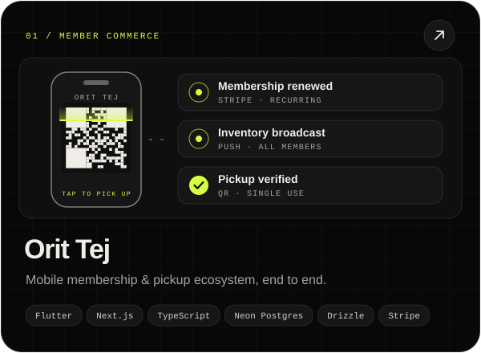
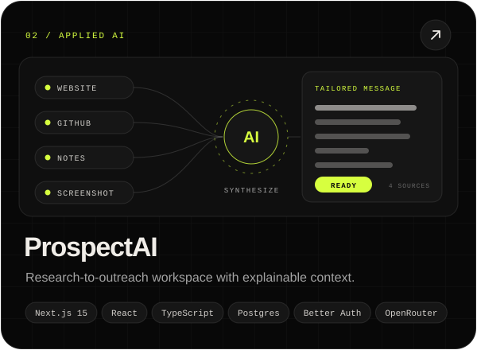
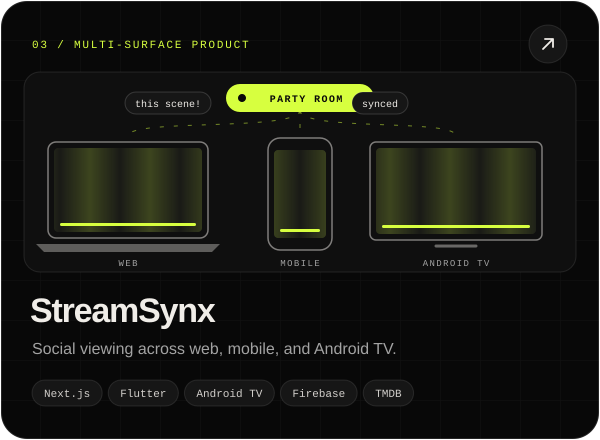
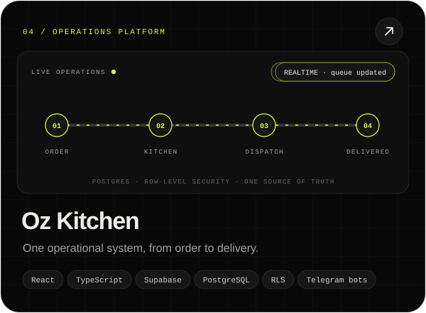
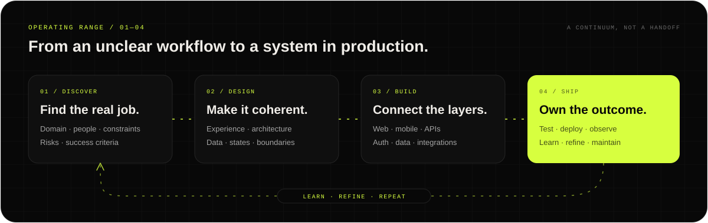
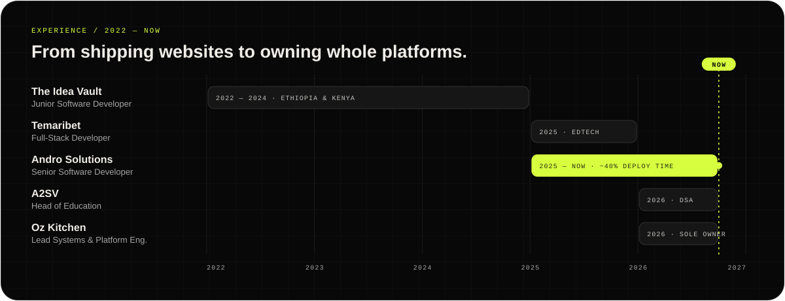
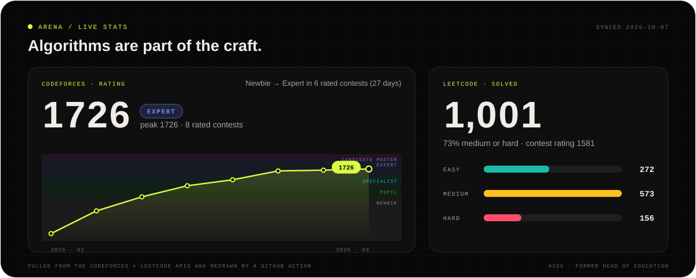

<a href="https://kidusmesfinportfolio.vercel.app/">
  <picture>
    <source media="(prefers-color-scheme: dark)" srcset="./assets/hero-dark.svg">
    <source media="(prefers-color-scheme: light)" srcset="./assets/hero-light.svg">
    
  </picture>
</a>

  <a href="https://kidusmesfinportfolio.vercel.app/"><strong>PORTFOLIO</strong></a>
  &nbsp;&nbsp;·&nbsp;&nbsp;
  <a href="https://kidusmesfinportfolio.vercel.app/resume.pdf"><strong>RÉSUMÉ</strong></a>
  &nbsp;&nbsp;·&nbsp;&nbsp;
  <a href="https://www.linkedin.com/in/kidus-m"><strong>LINKEDIN</strong></a>
  &nbsp;&nbsp;·&nbsp;&nbsp;
  <a href="https://marucheck.dev"><strong>MARUCHECK</strong></a>
  &nbsp;&nbsp;·&nbsp;&nbsp;
  <a href="mailto:kidusmesfinteferi@gmail.com"><strong>EMAIL</strong></a>

---

## I turn complicated workflows into software people can trust.

I’m a software engineer in Addis Ababa who works across the full product surface: interface, application logic, data model, integrations, deployment, and iteration. I’m most useful when a project is still a little messy—when the real job is to understand the operation, choose the right architecture, and carry it all the way to a polished product.

At **Andro Solutions**, I lead client platform work and mentor developers. Beyond that, I’ve built real-time operations software, cross-platform mobile apps, secure payment and membership flows, AI-assisted research tools, media products spanning web, mobile, and TV—and an open-source tool that checks the code AI agents write.

> My edge is not knowing the most tools. It is knowing how the pieces should work together—and taking responsibility for the result.

 

## Selected systems

Every card is live and clickable.

<a href="https://github.com/Kidus-M/MaruCheck">
  <picture>
    <source media="(prefers-color-scheme: dark)" srcset="./assets/marucheck-dark.svg">
    <source media="(prefers-color-scheme: light)" srcset="./assets/marucheck-light.svg">
    
  </picture>
</a>

  <a href="https://github.com/Kidus-M/Orit-Tej-Mobile"><picture><source media="(prefers-color-scheme: dark)" srcset="./assets/project-orit-tej-dark.svg"><source media="(prefers-color-scheme: light)" srcset="./assets/project-orit-tej-light.svg"></picture></a>
  <a href="https://github.com/Kidus-M/ProspectAI"><picture><source media="(prefers-color-scheme: dark)" srcset="./assets/project-prospectai-dark.svg"><source media="(prefers-color-scheme: light)" srcset="./assets/project-prospectai-light.svg"></picture></a>
  <a href="https://streamsynx.vercel.app/"><picture><source media="(prefers-color-scheme: dark)" srcset="./assets/project-streamsynx-dark.svg"><source media="(prefers-color-scheme: light)" srcset="./assets/project-streamsynx-light.svg"></picture></a>
  <a href="https://oz-kitchen-blue.vercel.app/"><picture><source media="(prefers-color-scheme: dark)" srcset="./assets/project-oz-kitchen-dark.svg"><source media="(prefers-color-scheme: light)" srcset="./assets/project-oz-kitchen-light.svg"></picture></a>

<strong>What’s inside each system?</strong> &nbsp;click to expand

 

| | System | What it does | Links |
|---|---|---|---|
| 00 | **MaruCheck** | Turns product intent into Quality Contracts, analyzes code changes, remembers regressions, and tests what your coding agent missed. Local-first CLI, CI gate, MCP server, and Claude Code Stop hook. | [Repo](https://github.com/Kidus-M/MaruCheck) · [Site](https://marucheck.dev) · [npm](https://www.npmjs.com/package/marucheck) |
| 01 | **Orit Tej** | Flutter member experience plus a Next.js API for persistent device sessions, recurring Stripe payments, inventory broadcasts, benefits, and secure one-time pickup QR flows. | [Mobile app](https://github.com/Kidus-M/Orit-Tej-Mobile) · [Backend](https://github.com/Kidus-M/Orit-Backend) |
| 02 | **ProspectAI** | Collects websites, GitHub signals, notes, and profile screenshots; synthesizes source material; generates tailored messages with model fallbacks; manages the conversation in one authenticated workspace. | [Repo](https://github.com/Kidus-M/ProspectAI) |
| 03 | **StreamSynx** | TMDB discovery, Firebase identity and data, watch history, favorites, recommendations, buddies, real-time watch-party rooms and chat—with a Flutter client and a native Android TV experience. | [Repo](https://github.com/Kidus-M/StreamSynx) · [Live](https://streamsynx.vercel.app/) |
| 04 | **Oz Kitchen** | Unified customer ordering, kitchen queues, administration, delivery assignment, payments, partner referrals, and Telegram automation over a real-time Postgres foundation. | [Live](https://oz-kitchen-blue.vercel.app/) |

 

<picture>
  <source media="(prefers-color-scheme: dark)" srcset="./assets/operating-range-dark.svg">
  <source media="(prefers-color-scheme: light)" srcset="./assets/operating-range-light.svg">
  
</picture>

## Experience, compressed

<picture>
  <source media="(prefers-color-scheme: dark)" srcset="./assets/experience-dark.svg">
  <source media="(prefers-color-scheme: light)" srcset="./assets/experience-light.svg">
  
</picture>

<strong>2025 — now · Senior Software Developer · Andro Solutions</strong>

<blockquote>Leading full-stack client platforms, architecture, CI/CD, and developer mentorship; reduced deployment time by 40%.</blockquote>

<strong>2026 · Lead Systems &amp; Platform Engineer · Oz Kitchen</strong>

<blockquote>Sole ownership of architecture, product surfaces, backend services, database design, automation, deployment, and iteration.</blockquote>

<strong>2026 · Head of Education · A2SV</strong>

<blockquote>Designed DSA training, led problem-solving sessions, reviewed technical work, and mentored software engineering students.</blockquote>

<strong>2025 · Full-Stack Developer · Temaribet</strong>

<blockquote>Built education-platform dashboards, FastAPI services, Redis caching, RabbitMQ workers, and React Native / Next.js features.</blockquote>

<strong>2022 — 2024 · Junior Software Developer · The Idea Vault</strong>

<blockquote>Shipped websites and visual systems while supporting brand consistency across Ethiopia and Kenya.</blockquote>

 

I’m also completing a **BSc in Computer Science at HiLCoE** and trained in advanced data structures and algorithms through **A2SV**.

 

## How I engineer

| Product thinking | Systems thinking | Delivery thinking |
|---|---|---|
| Start from the user and the operating reality—not the framework. | Model boundaries, data, failure cases, permissions, and integrations early. | Keep the path to production visible: tests, observability, deployment, and feedback. |
| Build interfaces with hierarchy, motion, and accessibility in mind. | Prefer boring, legible architecture until complexity earns something more. | Treat documentation and maintainability as part of the shipped product. |

<picture>
  <source media="(prefers-color-scheme: dark)" srcset="./assets/stack-dark.svg">
  <source media="(prefers-color-scheme: light)" srcset="./assets/stack-light.svg">
  
</picture>

<strong>The full toolbox, as text</strong>

 

- **Product surfaces:** TypeScript, React, Next.js, Flutter/Dart, React Native, Tailwind CSS, motion and interaction design, Figma
- **Services & integrations:** Node.js, Express, FastAPI, Go/Gin, REST APIs, payments, webhooks, background work, automation
- **Data & real time:** PostgreSQL, Supabase, Neon, Drizzle, MongoDB, Firebase, Redis, RabbitMQ
- **Engineering practice:** system design, API design, authentication, Git, CI/CD, testing, deployment and performance work

 

## Algorithms are part of the craft.

Product work benefits from patience, decomposition, and the ability to reason under constraints. I keep those muscles sharp through competitive programming—and I’ve also taught them.

<a href="https://codeforces.com/profile/KidusMesfin">
  <picture>
    <source media="(prefers-color-scheme: dark)" srcset="./assets/arena-dark.svg">
    <source media="(prefers-color-scheme: light)" srcset="./assets/arena-light.svg">
    
  </picture>
</a>

  <a href="https://codeforces.com/profile/KidusMesfin"><strong>CODEFORCES ↗</strong></a>
  &nbsp;&nbsp;·&nbsp;&nbsp;
  <a href="https://leetcode.com/u/Kidus_Mesfin/"><strong>LEETCODE ↗</strong></a>
  &nbsp;&nbsp;·&nbsp;&nbsp;
  <a href="https://a2sv.org"><strong>A2SV ↗</strong></a>

<strong>How is this page alive?</strong> &nbsp;a peek under the hood

 

Every graphic above is a hand-built SVG—no screenshots, no third-party widgets. They are generated by a zero-dependency Node script ([`scripts/build.mjs`](./scripts/build.mjs)) and animated with pure CSS keyframes and SMIL motion paths, in both light and dark themes.

Each morning a GitHub Action ([`refresh-profile.yml`](./.github/workflows/refresh-profile.yml)) pulls fresh numbers from the Codeforces, LeetCode, npm, and GitHub APIs ([`scripts/fetch-stats.mjs`](./scripts/fetch-stats.mjs)), redraws the graphics, and commits them only if something changed. If you prefer reduced motion, every animation switches off and the final frame is shown instead.

---

  <h2>Have a difficult workflow? I’d like to understand it.</h2>
  
I’m open to ambitious product work, platform engineering, and technical collaborations.

  

    <a href="mailto:kidusmesfinteferi@gmail.com"><strong>Start a conversation ↗</strong></a>
    &nbsp;&nbsp;·&nbsp;&nbsp;
    <a href="https://kidusmesfinportfolio.vercel.app/"><strong>See the full portfolio ↗</strong></a>
  

  Addis Ababa, Ethiopia · UTC+3

